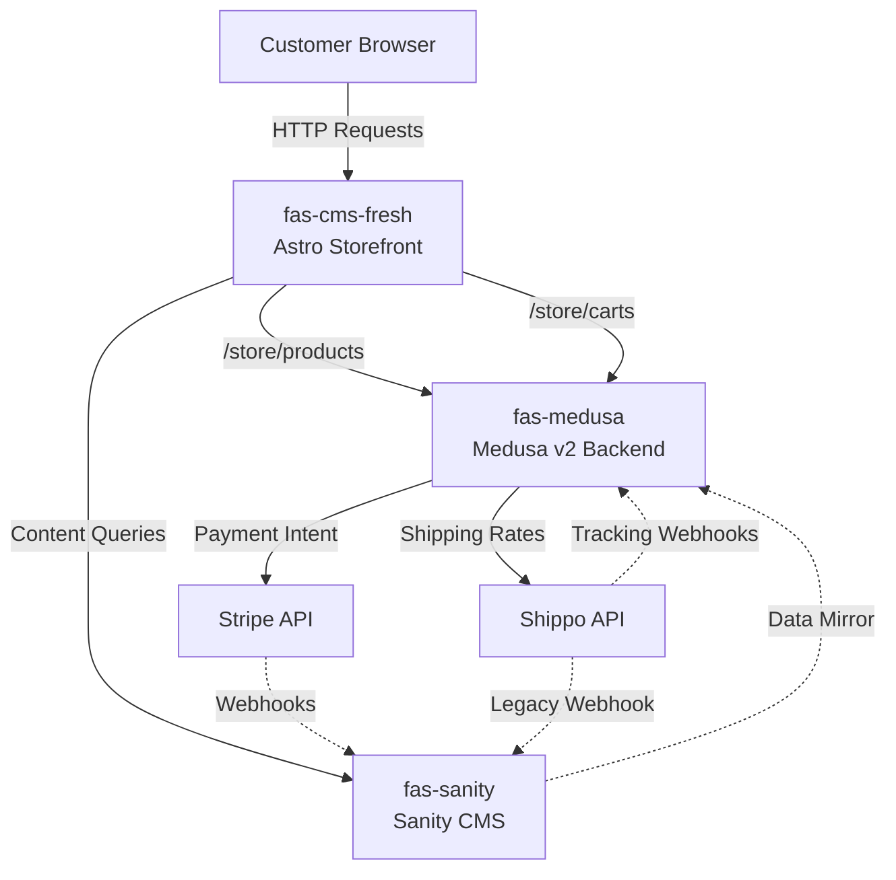

# FAS Motorsports: System Architecture & API Reference

**Version:** 1.0 (Phase 1 Complete)
**Last Updated:** 2026-02-03
**Status:** ✅ Complete Inventory (399 Endpoints/Functions/Routes)

---

## Executive Summary

This document serves as the **single source of truth** for all routes, API endpoints, Netlify functions, webhooks, and scheduled jobs across the FAS Motorsports multi-repository e-commerce system.

### System Overview

FAS Motorsports operates a **Medusa-first commerce architecture** spanning three interconnected repositories:

- **fas-cms-fresh** (Astro Storefront) - Customer-facing UI and proxy API layer
- **fas-medusa** (Medusa v2 Backend) - Authoritative commerce engine
- **fas-sanity** (Sanity CMS) - Content management and internal operations

### Inventory Summary

| Repository | Total Items | Breakdown |
|------------|-------------|------------|
| fas-cms-fresh | 277 | 129 UI routes, 98 API routes, 50 Netlify functions |
| fas-medusa | 30 | 3 custom routes, 27 core endpoints (documented) |
| fas-sanity | 92 | 88 functions, 4 scheduled jobs |
| **TOTAL** | **399** | Complete system inventory |

### Key Findings

✅ **Architecture Validated:** Medusa-first design confirmed across all repos
✅ **Minimal Custom Code:** fas-medusa relies on core Medusa v2 functionality
⚠️ **Legacy Code Identified:** 6 legacy routes in fas-cms-fresh need migration
✅ **Clear Boundaries:** Domain ownership and authority clearly defined

---

## Core Architecture Principles

### 2.1. Medusa-First Authority

**Critical Rule:** Medusa is the **authoritative source** for all commerce operations.

**Medusa OWNS:**
- Products, variants, pricing, inventory
- Cart creation and management
- Checkout and payment processing
- Orders and fulfillment
- Customer accounts and authentication
- Shipping calculations (via Shippo provider)

**⚠️ DO NOT:**
- Call fas-sanity for product pricing, inventory, or cart operations
- Duplicate commerce logic in fas-cms-fresh
- Implement checkout flows outside of Medusa

### 2.2. Domain Ownership

| Domain | Authoritative Repo | Purpose |
|--------|-------------------|----------|
| Commerce (Products, Cart, Orders) | fas-medusa | Source of truth for all commerce data |
| Content (Blog, Marketing Pages) | fas-sanity | Editorial content and CMS |
| UI/UX (Customer-Facing Pages) | fas-cms-fresh | Presentation layer only |
| Internal Ops (Invoices, Vendors) | fas-sanity | Back-office operations |
| Payment Processing | fas-medusa + Stripe | Medusa manages, Stripe executes |
| Shipping/Fulfillment | fas-medusa + Shippo | Medusa manages, Shippo executes |

### 2.3. Data Flow

```
Customer Request
    ↓
fas-cms-fresh (UI Layer)
    ↓
fas-medusa (Commerce Engine) ← Authoritative
    ↓
External Services (Stripe, Shippo)

Parallel:
fas-sanity (Content + Internal Ops)
    ↓
Mirrors commerce data for reporting (read-only)
```

---

## Cross-Repository Call Graph



---

## Authoritative Inventory by Repository

### 4.1. fas-cms-fresh (Storefront)

**Repository:** `/mnt/GitHub/fas-cms-fresh`
**Total Items:** 277

#### 4.1.1. UI Routes

**Total:** 129 routes

| ID | Public Path | File Path | Dynamic | Status |
|----|-------------|-----------|---------|--------|
| CMS-UI-001 | /about | /src/pages/about.astro | No | active |
| CMS-UI-002 | /account/edit/success | /src/pages/account/edit/success.astro | No | active |
| CMS-UI-003 | /account/edit | /src/pages/account/edit.astro | No | active |
| CMS-UI-004 | /account/forgot-password | /src/pages/account/forgot-password.astro | No | active |
| CMS-UI-005 | /account | /src/pages/account/index.astro | No | active |
| CMS-UI-006 | /account/reset | /src/pages/account/reset.astro | No | active |
| CMS-UI-007 | /admin | /src/pages/admin/index.astro | No | active |
| CMS-UI-008 | /admin/seo-dashboard | /src/pages/admin/seo-dashboard.astro | No | active |
| CMS-UI-009 | /admin/studio | /src/pages/admin/studio.astro | No | active |
| CMS-UI-010 | /appointments/[service] | /src/pages/appointments/[service].astro | Yes | active |
| CMS-UI-011 | /appointments/confirm | /src/pages/appointments/confirm.astro | No | active |
| CMS-UI-012 | /appointments/history | /src/pages/appointments/history.astro | No | active |
| CMS-UI-013 | /appointments | /src/pages/appointments/index.astro | No | active |
| CMS-UI-014 | /become-a-vendor | /src/pages/become-a-vendor.astro | No | active |
| CMS-UI-015 | /belak/series2 | /src/pages/belak/series2.astro | No | active |
| CMS-UI-016 | /belak/series3 | /src/pages/belak/series3.astro | No | active |
| CMS-UI-017 | /belak/skinnies | /src/pages/belak/skinnies.astro | No | active |
| CMS-UI-018 | /belak/thanks | /src/pages/belak/thanks.astro | No | active |
| CMS-UI-019 | /belak/wheels | /src/pages/belak/wheels.astro | No | active |
| CMS-UI-020 | /blackFridaySale | /src/pages/blackFridaySale.astro | No | active |
| CMS-UI-021 | /blog/[slug] | /src/pages/blog/[slug].astro | Yes | active |
| CMS-UI-022 | /blog | /src/pages/blog/index.astro | No | active |
| CMS-UI-023 | /cart | /src/pages/cart.astro | No | active |
| CMS-UI-024 | /checkout/cancel | /src/pages/checkout/cancel.astro | No | active |
| CMS-UI-025 | /checkout/index-with-toggle | /src/pages/checkout/index-with-toggle.astro | No | active |
| CMS-UI-026 | /checkout | /src/pages/checkout/index.astro | No | active |
| CMS-UI-027 | /checkout/return | /src/pages/checkout/return.astro | No | active |
| CMS-UI-028 | /checkout/success | /src/pages/checkout/success.astro | No | active |
| CMS-UI-029 | /checkout-legacy | /src/pages/checkout-legacy/index.astro | No | active |
| CMS-UI-030 | /contact/success | /src/pages/contact/success.astro | No | active |
| CMS-UI-031 | /contact | /src/pages/contact.astro | No | active |
| CMS-UI-032 | /customBuild | /src/pages/customBuild.astro | No | active |
| CMS-UI-033 | /customerdashboard/customerProfile | /src/pages/customerdashboard/customerProfile.astro | No | active |
| CMS-UI-034 | /customerdashboard/profile/success | /src/pages/customerdashboard/profile/success.astro | No | active |
| CMS-UI-035 | /customerdashboard/userAppointments | /src/pages/customerdashboard/userAppointments.astro | No | active |
| CMS-UI-036 | /customerdashboard/userInvoices | /src/pages/customerdashboard/userInvoices.astro | No | active |
| CMS-UI-037 | /customerdashboard/userOrders | /src/pages/customerdashboard/userOrders.astro | No | active |
| CMS-UI-038 | /customerdashboard/userQuotes | /src/pages/customerdashboard/userQuotes.astro | No | active |
| CMS-UI-039 | /dashboard/order/[id] | /src/pages/dashboard/order/[id].astro | Yes | active |
| CMS-UI-040 | /dashboard | /src/pages/dashboard.astro | No | active |
| CMS-UI-041 | /faq | /src/pages/faq.astro | No | active |
| CMS-UI-042 | /faq2 | /src/pages/faq2.astro | No | active |
| CMS-UI-043 | / | /src/pages/index.astro | No | active |
| CMS-UI-044 | /internalPolicy | /src/pages/internalPolicy.astro | No | active |
| CMS-UI-045 | /jtx/arc | /src/pages/jtx/arc.astro | No | active |
| CMS-UI-046 | /jtx/beadlock | /src/pages/jtx/beadlock.astro | No | active |
| CMS-UI-047 | /jtx/concave | /src/pages/jtx/concave.astro | No | active |
| CMS-UI-048 | /jtx/dually | /src/pages/jtx/dually.astro | No | active |
| CMS-UI-049 | /jtx/monoforged | /src/pages/jtx/monoforged.astro | No | active |
| CMS-UI-050 | /jtx/phantom | /src/pages/jtx/phantom.astro | No | active |
| CMS-UI-051 | /jtx/retro | /src/pages/jtx/retro.astro | No | active |
| CMS-UI-052 | /jtx/rock-ring | /src/pages/jtx/rock-ring.astro | No | active |
| CMS-UI-053 | /jtx/single | /src/pages/jtx/single.astro | No | active |
| CMS-UI-054 | /jtx/thanks | /src/pages/jtx/thanks.astro | No | active |
| CMS-UI-055 | /jtx/two-piece | /src/pages/jtx/two-piece.astro | No | active |
| CMS-UI-056 | /jtx/utv | /src/pages/jtx/utv.astro | No | active |
| CMS-UI-057 | /jtx/wheels | /src/pages/jtx/wheels.astro | No | active |
| CMS-UI-058 | /orders/support/success | /src/pages/orders/support/success.astro | No | active |
| CMS-UI-059 | /packages | /src/pages/packages/index.astro | No | active |
| CMS-UI-060 | /packages/powerPackages | /src/pages/packages/powerPackages.astro | No | active |
| CMS-UI-061 | /packages/truckPackages | /src/pages/packages/truckPackages.astro | No | active |
| CMS-UI-062 | /press-media | /src/pages/press-media.astro | No | active |
| CMS-UI-063 | /privacypolicy | /src/pages/privacypolicy.astro | No | active |
| CMS-UI-064 | /resources/employee-sms-consent | /src/pages/resources/employee-sms-consent.astro | No | active |
| CMS-UI-065 | /returnRefundPolicy | /src/pages/returnRefundPolicy.astro | No | active |
| CMS-UI-066 | /sales/cyberMonday | /src/pages/sales/cyberMonday.astro | No | active |
| CMS-UI-067 | /schedule | /src/pages/schedule.astro | No | active |
| CMS-UI-068 | /search | /src/pages/search.astro | No | active |
| CMS-UI-069 | /services/coreExchange | /src/pages/services/coreExchange.astro | No | active |
| CMS-UI-070 | /services/customFab | /src/pages/services/customFab.astro | No | active |
| CMS-UI-071 | /services/igla | /src/pages/services/igla.astro | No | active |
| CMS-UI-072 | /services/overview | /src/pages/services/overview.astro | No | active |
| CMS-UI-073 | /services/porting | /src/pages/services/porting.astro | No | active |
| CMS-UI-074 | /services/welding | /src/pages/services/welding.astro | No | active |
| CMS-UI-075 | /shop/[slug] | /src/pages/shop/[slug].astro | Yes | active |
| CMS-UI-076 | /shop/categories/[category] | /src/pages/shop/categories/[category].astro | Yes | active |
| CMS-UI-077 | /shop/categories | /src/pages/shop/categories.astro | No | active |
| CMS-UI-078 | /shop/filters/[filters] | /src/pages/shop/filters/[filters].astro | Yes | active |
| CMS-UI-079 | /shop | /src/pages/shop/index.astro | No | active |
| CMS-UI-080 | /shop/performance-packages | /src/pages/shop/performance-packages/index.astro | No | active |
| CMS-UI-081 | /shop/sale/[tags] | /src/pages/shop/sale/[tags].astro | Yes | active |
| CMS-UI-082 | /shop/storefront | /src/pages/shop/storefront.astro | No | active |
| CMS-UI-083 | /specs/BilletBearingPlate | /src/pages/specs/BilletBearingPlate.astro | No | active |
| CMS-UI-084 | /specs/BilletLid | /src/pages/specs/BilletLid.astro | No | active |
| CMS-UI-085 | /specs/BilletSnout | /src/pages/specs/BilletSnout.astro | No | active |
| CMS-UI-086 | /specs/BilletThrottleBody108 | /src/pages/specs/BilletThrottleBody108.astro | No | active |
| CMS-UI-087 | /specs/PredatorPulley | /src/pages/specs/PredatorPulley.astro | No | active |
| CMS-UI-088 | /specs/PulleyHub | /src/pages/specs/PulleyHub.astro | No | active |
| CMS-UI-089 | /specs/billet-snouts | /src/pages/specs/billet-snouts.astro | No | active |
| CMS-UI-090 | /termsandconditions | /src/pages/termsandconditions.astro | No | active |
| CMS-UI-091 | /vendor-portal/account | /src/pages/vendor-portal/account.astro | No | active |
| CMS-UI-092 | /vendor-portal/analytics | /src/pages/vendor-portal/analytics.astro | No | active |
| CMS-UI-093 | /vendor-portal/blog/[slug] | /src/pages/vendor-portal/blog/[slug].astro | Yes | active |
| CMS-UI-094 | /vendor-portal/blog | /src/pages/vendor-portal/blog/index.astro | No | active |
| CMS-UI-095 | /vendor-portal/cart | /src/pages/vendor-portal/cart.astro | No | active |
| CMS-UI-096 | /vendor-portal/catalog | /src/pages/vendor-portal/catalog.astro | No | active |
| CMS-UI-097 | /vendor-portal/dashboard | /src/pages/vendor-portal/dashboard.astro | No | active |
| CMS-UI-098 | /vendor-portal/documents | /src/pages/vendor-portal/documents.astro | No | active |
| CMS-UI-099 | /vendor-portal/forgot-password | /src/pages/vendor-portal/forgot-password.astro | No | active |
| CMS-UI-100 | /vendor-portal/help | /src/pages/vendor-portal/help.astro | No | active |
| CMS-UI-101 | /vendor-portal | /src/pages/vendor-portal/index.astro | No | active |
| CMS-UI-102 | /vendor-portal/inventory | /src/pages/vendor-portal/inventory.astro | No | active |
| CMS-UI-103 | /vendor-portal/invoices | /src/pages/vendor-portal/invoices.astro | No | active |
| CMS-UI-104 | /vendor-portal/login | /src/pages/vendor-portal/login.astro | No | active |
| CMS-UI-105 | /vendor-portal/notifications | /src/pages/vendor-portal/notifications.astro | No | active |
| CMS-UI-106 | /vendor-portal/onboarding/analytics | /src/pages/vendor-portal/onboarding/analytics.astro | No | active |
| CMS-UI-107 | /vendor-portal/onboarding/best-practices | /src/pages/vendor-portal/onboarding/best-practices.astro | No | active |
| CMS-UI-108 | /vendor-portal/onboarding/communication | /src/pages/vendor-portal/onboarding/communication.astro | No | active |
| CMS-UI-109 | /vendor-portal/onboarding/dashboard | /src/pages/vendor-portal/onboarding/dashboard.astro | No | active |
| CMS-UI-110 | /vendor-portal/onboarding/downloads | /src/pages/vendor-portal/onboarding/downloads.astro | No | active |
| CMS-UI-111 | /vendor-portal/onboarding/faq | /src/pages/vendor-portal/onboarding/faq.astro | No | active |
| CMS-UI-112 | /vendor-portal/onboarding/getting-started | /src/pages/vendor-portal/onboarding/getting-started.astro | No | active |
| CMS-UI-113 | /vendor-portal/onboarding | /src/pages/vendor-portal/onboarding/index.astro | No | active |
| CMS-UI-114 | /vendor-portal/onboarding/inventory | /src/pages/vendor-portal/onboarding/inventory.astro | No | active |
| CMS-UI-115 | /vendor-portal/onboarding/invoicing | /src/pages/vendor-portal/onboarding/invoicing.astro | No | active |
| CMS-UI-116 | /vendor-portal/onboarding/orders | /src/pages/vendor-portal/onboarding/orders.astro | No | active |
| CMS-UI-117 | /vendor-portal/onboarding/support | /src/pages/vendor-portal/onboarding/support.astro | No | active |
| CMS-UI-118 | /vendor-portal/orders/[id] | /src/pages/vendor-portal/orders/[id].astro | Yes | active |
| CMS-UI-119 | /vendor-portal/orders | /src/pages/vendor-portal/orders.astro | No | active |
| CMS-UI-120 | /vendor-portal/payments | /src/pages/vendor-portal/payments/index.astro | No | active |
| CMS-UI-121 | /vendor-portal/products | /src/pages/vendor-portal/products.astro | No | active |
| CMS-UI-122 | /vendor-portal/releases | /src/pages/vendor-portal/releases.astro | No | active |
| CMS-UI-123 | /vendor-portal/reset-password | /src/pages/vendor-portal/reset-password.astro | No | active |
| CMS-UI-124 | /vendor-portal/returns | /src/pages/vendor-portal/returns.astro | No | active |
| CMS-UI-125 | /vendor-portal/settings | /src/pages/vendor-portal/settings.astro | No | active |
| CMS-UI-126 | /vendor-portal/setup | /src/pages/vendor-portal/setup.astro | No | active |
| CMS-UI-127 | /vendors/[slug] | /src/pages/vendors/[slug].astro | Yes | active |
| CMS-UI-128 | /vendors | /src/pages/vendors/index.astro | No | active |
| CMS-UI-129 | /warranty | /src/pages/warranty.astro | No | active |

#### 4.1.2. API Routes

**Total:** 98 routes

| ID | Public Path | Methods | File Path | Status | Notes |
|----|-------------|---------|-----------|--------|-------|
| CMS-API-001 | /api/admin/orders/[id] | PATCH | /src/pages/api/admin/orders/[id].ts | active | Dynamic route |
| CMS-API-002 | /api/admin/orders | GET | /src/pages/api/admin/orders/index.ts | active |  |
| CMS-API-003 | /api/appointments | GET | /src/pages/api/appointments.ts | active |  |
| CMS-API-004 | /api/attribution/track | POST | /src/pages/api/attribution/track.ts | active |  |
| CMS-API-005 | /api/auth/forgot-password | POST | /src/pages/api/auth/forgot-password.ts | active |  |
| CMS-API-006 | /api/auth/login | POST | /src/pages/api/auth/login.ts | active |  |
| CMS-API-007 | /api/auth/logout | GET | /src/pages/api/auth/logout.ts | active |  |
| CMS-API-008 | /api/auth/password-reset/confirm | POST | /src/pages/api/auth/password-reset/confirm.ts | active |  |
| CMS-API-009 | /api/auth/password-reset/request | POST | /src/pages/api/auth/password-reset/request.ts | active |  |
| CMS-API-010 | /api/auth/reset-password | GET, POST | /src/pages/api/auth/reset-password.ts | active |  |
| CMS-API-011 | /api/auth/session | GET | /src/pages/api/auth/session.ts | active |  |
| CMS-API-012 | /api/auth/signup | GET, POST | /src/pages/api/auth/signup.ts | active |  |
| CMS-API-013 | /api/booking | UNKNOWN | /src/pages/api/booking.ts | active |  |
| CMS-API-014 | /api/bookings/create | UNKNOWN | /src/pages/api/bookings/create.ts | active |  |
| CMS-API-015 | /api/build-quote | POST | /src/pages/api/build-quote.ts | active |  |
| CMS-API-016 | /api/calcom/availability | UNKNOWN | /src/pages/api/calcom/availability.ts | active |  |
| CMS-API-017 | /api/calcom/webhook | UNKNOWN | /src/pages/api/calcom/webhook.ts | active |  |
| CMS-API-018 | /api/cart | POST | /src/pages/api/cart.ts | active |  |
| CMS-API-019 | /api/collections/[slug] | GET | /src/pages/api/collections/[slug].ts | active | Dynamic route |
| CMS-API-020 | /api/collections/featured | GET | /src/pages/api/collections/featured.ts | active |  |
| CMS-API-021 | /api/collections/menu | GET | /src/pages/api/collections/menu.ts | active |  |
| CMS-API-022 | /api/contact | POST | /src/pages/api/contact.ts | active |  |
| CMS-API-023 | /api/customer/get | POST | /src/pages/api/customer/get.ts | active |  |
| CMS-API-024 | /api/customer/update | POST | /src/pages/api/customer/update.ts | active |  |
| CMS-API-025 | /api/debug | GET | /src/pages/api/debug.ts | active |  |
| CMS-API-026 | /api/form-submission | POST | /src/pages/api/form-submission.ts | active |  |
| CMS-API-027 | /api/generate-blog | GET, POST | /src/pages/api/generate-blog.ts | active |  |
| CMS-API-028 | /api/get-customer-profile | GET | /src/pages/api/get-customer-profile.ts | active |  |
| CMS-API-029 | /api/get-user-appointments | GET | /src/pages/api/get-user-appointments.ts | active |  |
| CMS-API-030 | /api/get-user-invoices | GET | /src/pages/api/get-user-invoices.ts | active |  |
| CMS-API-031 | /api/get-user-order | GET | /src/pages/api/get-user-order.ts | active |  |
| CMS-API-032 | /api/get-user-quotes | GET | /src/pages/api/get-user-quotes.ts | active |  |
| CMS-API-033 | /api/legacy/medusa/checkout/complete | POST | /src/pages/api/legacy/medusa/checkout/complete.ts | legacy |  |
| CMS-API-034 | /api/legacy/medusa/checkout/create-session | POST | /src/pages/api/legacy/medusa/checkout/create-session.ts | legacy |  |
| CMS-API-035 | /api/legacy/quote | POST | /src/pages/api/legacy/quote.ts | legacy |  |
| CMS-API-036 | /api/legacy/save-order | POST | /src/pages/api/legacy/save-order.ts | legacy |  |
| CMS-API-037 | /api/legacy/stripe/create-checkout-session | POST | /src/pages/api/legacy/stripe/create-checkout-session.ts | legacy |  |
| CMS-API-038 | /api/legacy/webhooks | POST | /src/pages/api/legacy/webhooks.ts | legacy |  |
| CMS-API-039 | /api/medusa/cart/add-item | POST | /src/pages/api/medusa/cart/add-item.ts | active |  |
| CMS-API-040 | /api/medusa/cart/create | POST | /src/pages/api/medusa/cart/create.ts | active |  |
| CMS-API-041 | /api/medusa/cart/select-shipping | POST | /src/pages/api/medusa/cart/select-shipping.ts | active |  |
| CMS-API-042 | /api/medusa/cart/shipping-options | POST | /src/pages/api/medusa/cart/shipping-options.ts | active |  |
| CMS-API-043 | /api/medusa/cart/update-address | POST | /src/pages/api/medusa/cart/update-address.ts | active |  |
| CMS-API-044 | /api/medusa/payments/create-intent | POST | /src/pages/api/medusa/payments/create-intent.ts | active |  |
| CMS-API-045 | /api/medusa/webhooks/payment-intent | POST | /src/pages/api/medusa/webhooks/payment-intent.ts | active |  |
| CMS-API-046 | /api/orders/[id] | GET, PATCH | /src/pages/api/orders/[id].ts | active | Dynamic route |
| CMS-API-047 | /api/orders/check-by-payment-intent | GET | /src/pages/api/orders/check-by-payment-intent.ts | active |  |
| CMS-API-048 | /api/products/[productId]/reviews | GET | /src/pages/api/products/[productId]/reviews.ts | active | Dynamic route |
| CMS-API-049 | /api/products/[slug] | UNKNOWN | /src/pages/api/products/[slug].ts | active | Dynamic route |
| CMS-API-050 | /api/products | GET | /src/pages/api/products.ts | active |  |
| CMS-API-051 | /api/promotions/[slug] | GET | /src/pages/api/promotions/[slug].ts | active | Dynamic route |
| CMS-API-052 | /api/promotions/active | GET | /src/pages/api/promotions/active.ts | active |  |
| CMS-API-053 | /api/promotions/apply | POST | /src/pages/api/promotions/apply.ts | active |  |
| CMS-API-054 | /api/promotions/validate | GET, POST | /src/pages/api/promotions/validate.ts | active |  |
| CMS-API-055 | /api/reviews/[reviewId]/vote | POST | /src/pages/api/reviews/[reviewId]/vote.ts | active | Dynamic route |
| CMS-API-056 | /api/reviews/submit | POST | /src/pages/api/reviews/submit.ts | active |  |
| CMS-API-057 | /api/sales-lead | POST | /src/pages/api/sales-lead.ts | active |  |
| CMS-API-058 | /api/sanity/categories | GET | /src/pages/api/sanity/categories.ts | active |  |
| CMS-API-059 | /api/save-quote | POST | /src/pages/api/save-quote.ts | active |  |
| CMS-API-060 | /api/search | GET | /src/pages/api/search.ts | active |  |
| CMS-API-061 | /api/site-search | GET | /src/pages/api/site-search.ts | active |  |
| CMS-API-062 | /api/status | GET | /src/pages/api/status.ts | active |  |
| CMS-API-063 | /api/tunes | GET | /src/pages/api/tunes.ts | active |  |
| CMS-API-064 | /api/upload-wheel-asset | UNKNOWN | /src/pages/api/upload-wheel-asset.ts | active |  |
| CMS-API-065 | /api/vehicles | GET | /src/pages/api/vehicles.ts | active |  |
| CMS-API-066 | /api/vendor/analytics | GET | /src/pages/api/vendor/analytics.ts | active |  |
| CMS-API-067 | /api/vendor/auth/setup | POST | /src/pages/api/vendor/auth/setup.ts | active |  |
| CMS-API-068 | /api/vendor/blog | GET | /src/pages/api/vendor/blog.ts | active |  |
| CMS-API-069 | /api/vendor/dashboard | GET | /src/pages/api/vendor/dashboard.ts | active |  |
| CMS-API-070 | /api/vendor/documents/upload | POST | /src/pages/api/vendor/documents/upload.ts | active |  |
| CMS-API-071 | /api/vendor/documents | GET | /src/pages/api/vendor/documents.ts | active |  |
| CMS-API-072 | /api/vendor/inventory | GET, PUT | /src/pages/api/vendor/inventory.ts | active |  |
| CMS-API-073 | /api/vendor/invoices/[id]/pay | POST | /src/pages/api/vendor/invoices/[id]/pay.ts | active | Dynamic route |
| CMS-API-074 | /api/vendor/invoices/[id] | GET | /src/pages/api/vendor/invoices/[id].ts | active | Dynamic route |
| CMS-API-075 | /api/vendor/invoices | GET | /src/pages/api/vendor/invoices.ts | active |  |
| CMS-API-076 | /api/vendor/logout | POST | /src/pages/api/vendor/logout.ts | active |  |
| CMS-API-077 | /api/vendor/me | GET | /src/pages/api/vendor/me.ts | active |  |
| CMS-API-078 | /api/vendor/notifications | GET, PUT | /src/pages/api/vendor/notifications/index.ts | active |  |
| CMS-API-079 | /api/vendor/notifications/unread-count | GET | /src/pages/api/vendor/notifications/unread-count.ts | active |  |
| CMS-API-080 | /api/vendor/orders/[id] | GET | /src/pages/api/vendor/orders/[id].ts | active | Dynamic route |
| CMS-API-081 | /api/vendor/orders/submit | POST | /src/pages/api/vendor/orders/submit.ts | active |  |
| CMS-API-082 | /api/vendor/orders | GET | /src/pages/api/vendor/orders.ts | active |  |
| CMS-API-083 | /api/vendor/password-reset/confirm | POST | /src/pages/api/vendor/password-reset/confirm.ts | active |  |
| CMS-API-084 | /api/vendor/payments | GET | /src/pages/api/vendor/payments.ts | active |  |
| CMS-API-085 | /api/vendor/products | GET, PUT | /src/pages/api/vendor/products.ts | active |  |
| CMS-API-086 | /api/vendor/returns | GET, POST | /src/pages/api/vendor/returns/index.ts | active |  |
| CMS-API-087 | /api/vendor/settings/addresses | GET, POST, PATCH, DELETE | /src/pages/api/vendor/settings/addresses.ts | active |  |
| CMS-API-088 | /api/vendor/settings/notifications | GET, PUT | /src/pages/api/vendor/settings/notifications.ts | active |  |
| CMS-API-089 | /api/vendor/settings/password | PUT | /src/pages/api/vendor/settings/password.ts | active |  |
| CMS-API-090 | /api/vendor/settings/profile | GET, PUT | /src/pages/api/vendor/settings/profile.ts | active |  |
| CMS-API-091 | /api/vendor-application | POST | /src/pages/api/vendor-application.ts | active |  |
| CMS-API-092 | /api/vendors/create-order | POST | /src/pages/api/vendors/create-order.ts | active |  |
| CMS-API-093 | /api/vendors/invite | POST | /src/pages/api/vendors/invite.ts | active |  |
| CMS-API-094 | /api/vendors/setup | GET, POST | /src/pages/api/vendors/setup.ts | active |  |
| CMS-API-095 | /api/wheel-quote-belak | POST | /src/pages/api/wheel-quote-belak.ts | active |  |
| CMS-API-096 | /api/wheel-quote-jtx | POST | /src/pages/api/wheel-quote-jtx.ts | active |  |
| CMS-API-097 | /api/wheel-quote-update | POST, PATCH | /src/pages/api/wheel-quote-update.ts | active |  |
| CMS-API-098 | /api/wheel-quotes | GET | /src/pages/api/wheel-quotes.ts | active |  |

#### 4.1.3. Netlify Functions & Scheduled Jobs

**Total:** 50 functions

| ID | Function Name | Public Path | Type | Status |
|----|---------------|-------------|------|--------|
| CMS-NF-001 | _auth | N/A (Helper) | Netlify Function | active |
| CMS-NF-002 | _debug-auth-env | N/A (Helper) | Netlify Function | active |
| CMS-NF-003 | _inventory | N/A (Helper) | Netlify Function | active |
| CMS-NF-004 | _resend | N/A (Helper) | Netlify Function | active |
| CMS-NF-005 | _sanity | N/A (Helper) | Netlify Function | active |
| CMS-NF-006 | _stripe | N/A (Helper) | Netlify Function | active |
| CMS-NF-007 | auth-logout | /.netlify/functions/auth-logout | Netlify Function | active |
| CMS-NF-008 | categories-delete | /.netlify/functions/categories-delete | Netlify Function | active |
| CMS-NF-009 | categories-list | /.netlify/functions/categories-list | Netlify Function | active |
| CMS-NF-010 | categories-upsert | /.netlify/functions/categories-upsert | Netlify Function | active |
| CMS-NF-011 | clean-reserved-inventory | /.netlify/functions/clean-reserved-inventory | Netlify Scheduled Function | active |
| CMS-NF-012 | collection-counts-cron | /.netlify/functions/collection-counts-cron | Netlify Scheduled Function | active |
| CMS-NF-013 | customers-detail | /.netlify/functions/customers-detail | Netlify Function | active |
| CMS-NF-014 | customers-invoice-create | /.netlify/functions/customers-invoice-create | Netlify Function | active |
| CMS-NF-015 | customers-list | /.netlify/functions/customers-list | Netlify Function | active |
| CMS-NF-016 | customers-profile-get | /.netlify/functions/customers-profile-get | Netlify Function | active |
| CMS-NF-017 | customers-profile-list | /.netlify/functions/customers-profile-list | Netlify Function | active |
| CMS-NF-018 | customers-profile-upsert | /.netlify/functions/customers-profile-upsert | Netlify Function | active |
| CMS-NF-019 | employee-sms-consent | /.netlify/functions/employee-sms-consent | Netlify Function | active |
| CMS-NF-020 | inventory-check | /.netlify/functions/inventory-check | Netlify Function | active |
| CMS-NF-021 | inventory-sync | /.netlify/functions/inventory-sync | Netlify Scheduled Function | active |
| CMS-NF-022 | invoice-send | /.netlify/functions/invoice-send | Netlify Function | active |
| CMS-NF-023 | invoices-list | /.netlify/functions/invoices-list | Netlify Function | active |
| CMS-NF-024 | merchant-feed-upload-cron | /.netlify/functions/merchant-feed-upload-cron | Netlify Scheduled Function | active |
| CMS-NF-025 | message-detail | /.netlify/functions/message-detail | Netlify Function | active |
| CMS-NF-026 | message-reply | /.netlify/functions/message-reply | Netlify Function | active |
| CMS-NF-027 | messages-list | /.netlify/functions/messages-list | Netlify Function | active |
| CMS-NF-028 | order-detail | /.netlify/functions/order-detail | Netlify Function | active |
| CMS-NF-029 | order-update-status | /.netlify/functions/order-update-status | Netlify Function | active |
| CMS-NF-030 | orders-list | /.netlify/functions/orders-list | Netlify Function | active |
| CMS-NF-031 | products-create | /.netlify/functions/products-create | Netlify Function | active |
| CMS-NF-032 | products-delete | /.netlify/functions/products-delete | Netlify Function | active |
| CMS-NF-033 | products-detail | /.netlify/functions/products-detail | Netlify Function | active |
| CMS-NF-034 | products-duplicate | /.netlify/functions/products-duplicate | Netlify Function | active |
| CMS-NF-035 | products-list | /.netlify/functions/products-list | Netlify Function | active |
| CMS-NF-036 | products-upsert | /.netlify/functions/products-upsert | Netlify Function | active |
| CMS-NF-037 | promotion-status-cron | /.netlify/functions/promotion-status-cron | Netlify Scheduled Function | active |
| CMS-NF-038 | purge-cache | /.netlify/functions/purge-cache | Netlify Function | active |
| CMS-NF-039 | quotes-convert-to-invoice | /.netlify/functions/quotes-convert-to-invoice | Netlify Function | active |
| CMS-NF-040 | quotes-list | /.netlify/functions/quotes-list | Netlify Function | active |
| CMS-NF-041 | quotes-send | /.netlify/functions/quotes-send | Netlify Function | active |
| CMS-NF-042 | quotes-upsert | /.netlify/functions/quotes-upsert | Netlify Function | active |
| CMS-NF-043 | review-aggregation | /.netlify/functions/review-aggregation | Netlify Function | active |
| CMS-NF-044 | sale-status-cron | /.netlify/functions/sale-status-cron | Netlify Scheduled Function | active |
| CMS-NF-045 | seo-maintenance | /.netlify/functions/seo-maintenance | Netlify Scheduled Function | active |
| CMS-NF-046 | submission-created | /.netlify/functions/submission-created | Netlify Function | active |
| CMS-NF-047 | tracking-update | /.netlify/functions/tracking-update | Netlify Function | active |
| CMS-NF-048 | upload-image | /.netlify/functions/upload-image | Netlify Function | active |
| CMS-NF-049 | vendor-application | /.netlify/functions/vendor-application | Netlify Function | active |
| CMS-NF-050 | welcome-subscriber | /.netlify/functions/welcome-subscriber | Netlify Function | active |

---

### 4.2. fas-medusa (Commerce Engine)

**Repository:** `/mnt/GitHub/fas-medusa`
**Total Custom Routes:** 3
**Core Endpoints Documented:** 27

#### 4.2.1. Custom Store API Endpoints

| ID | Endpoint Path | Methods | File Path | Status | Description |
|----|---------------|---------|-----------|--------|-------------|
| MED-STORE-01 | /store/custom | GET | /src/api/store/custom/route.ts | active | Custom health check endpoint |

#### 4.2.2. Custom Admin API Endpoints

| ID | Endpoint Path | Methods | File Path | Status | Description |
|----|---------------|---------|-----------|--------|-------------|
| MED-ADMIN-01 | /admin/custom | GET | /src/api/admin/custom/route.ts | active | Custom health check endpoint |

#### 4.2.3. Webhook Handlers

| ID | Endpoint Path | Methods | File Path | Status | Description |
|----|---------------|---------|-----------|--------|-------------|
| MED-WH-01 | /webhooks/shippo | POST | /src/api/webhooks/shippo/route.ts | active | Shippo tracking webhook handler |

#### 4.2.4. Core Medusa Endpoints (In Use)

These are **standard Medusa v2 core endpoints** that fas-cms-fresh calls.

**Store Endpoints:**

| ID | Endpoint Path | Methods | Description |
|----|---------------|---------|-------------|
| MED-CORE-STORE-01 | /store/products | GET | List products |
| MED-CORE-STORE-02 | /store/products/:id | GET | Get product by ID |
| MED-CORE-STORE-03 | /store/product-categories | GET | List product categories |
| MED-CORE-STORE-04 | /store/collections | GET | List collections |
| MED-CORE-STORE-05 | /store/carts | POST | Create cart |
| MED-CORE-STORE-06 | /store/carts/:id | GET, POST | Get/update cart |
| MED-CORE-STORE-07 | /store/carts/:id/line-items | POST, DELETE | Add/remove cart items |
| MED-CORE-STORE-08 | /store/carts/:id/shipping-methods | POST | Add shipping method |
| MED-CORE-STORE-09 | /store/carts/:id/payment-sessions | POST | Initialize payment |
| MED-CORE-STORE-10 | /store/carts/:id/complete | POST | Complete cart checkout |
| MED-CORE-STORE-11 | /store/customers | POST | Create customer |
| MED-CORE-STORE-12 | /store/customers/me | GET | Get customer profile |
| MED-CORE-STORE-13 | /store/customers/me/orders | GET | List customer orders |
| MED-CORE-STORE-14 | /store/auth | POST, DELETE | Customer auth |
| MED-CORE-STORE-15 | /store/regions | GET | List regions |
| MED-CORE-STORE-16 | /store/shipping-options | GET | List shipping options |
| MED-CORE-STORE-17 | /store/payment-providers | GET | List payment providers |

**Admin Endpoints:**

| ID | Endpoint Path | Methods | Description |
|----|---------------|---------|-------------|
| MED-CORE-ADMIN-01 | /admin/products | GET, POST | List/create products |
| MED-CORE-ADMIN-02 | /admin/products/:id | GET, POST, DELETE | Get/update/delete product |
| MED-CORE-ADMIN-03 | /admin/orders | GET | List orders |
| MED-CORE-ADMIN-04 | /admin/orders/:id | GET, POST | Get/update order |
| MED-CORE-ADMIN-05 | /admin/customers | GET, POST | List/create customers |
| MED-CORE-ADMIN-06 | /admin/customers/:id | GET, POST, DELETE | Get/update/delete customer |
| MED-CORE-ADMIN-07 | /admin/auth | POST, DELETE | Admin auth |
| MED-CORE-ADMIN-08 | /admin/users | GET, POST | List/create admin users |
| MED-CORE-ADMIN-09 | /admin/inventory-items | GET | List inventory |
| MED-CORE-ADMIN-10 | /admin/fulfillments | POST | Create fulfillment |

---

### 4.3. fas-sanity (CMS & Operations)

**Repository:** `/mnt/GitHub/fas-sanity`
**Total Functions:** 88
**Scheduled Jobs:** 4

#### 4.3.1. Netlify Functions (by Category)

**Other/Utility** (14 functions)

| ID | Function Name | Public Path | Type | Status |
|----|---------------|-------------|------|--------|
| SAN-OU-01 | api-docs | /.netlify/functions/api-docs | HTTP Function | active |
| SAN-OU-02 | calculate-profit-loss | /.netlify/functions/calculate-profit-loss | Scheduled Function | active |
| SAN-OU-03 | cleanupFunctionLogs | /.netlify/functions/cleanupFunctionLogs | Scheduled Function | active |
| SAN-OU-04 | createFinancialConnectionSession | /.netlify/functions/createFinancialConnectionSession | HTTP Function | active |
| SAN-OU-05 | createRefund | /.netlify/functions/createRefund | HTTP Function | active |
| SAN-OU-06 | fetchSiteTraffic | /.netlify/functions/fetchSiteTraffic | HTTP Function | active |
| SAN-OU-07 | finalizeFinancialConnection | /.netlify/functions/finalizeFinancialConnection | HTTP Function | active |
| SAN-OU-08 | fixCardDetails | /.netlify/functions/fixCardDetails | HTTP Function | active |
| SAN-OU-09 | logDrainProxy | /.netlify/functions/logDrainProxy | HTTP Function | active |
| SAN-OU-10 | masterBackfill | /.netlify/functions/masterBackfill | HTTP Function | active |
| SAN-OU-11 | notify-sms | /.netlify/functions/notify-sms | Scheduled Function | active |
| SAN-OU-12 | repo-scan | /.netlify/functions/repo-scan | HTTP Function | active |
| SAN-OU-13 | userData | /.netlify/functions/userData | HTTP Function | active |
| SAN-OU-14 | welcome-subscriber | /.netlify/functions/welcome-subscriber | HTTP Function | active |

**Email/Notification** (11 functions)

| ID | Function Name | Public Path | Type | Status |
|----|---------------|-------------|------|--------|
| SAN-EN-01 | email-health | /.netlify/functions/email-health | HTTP Function | active |
| SAN-EN-02 | email-subscribe | /.netlify/functions/email-subscribe | HTTP Function | active |
| SAN-EN-03 | emailEvents | /.netlify/functions/emailEvents | HTTP Function | active |
| SAN-EN-04 | resendInvoiceEmail | /.netlify/functions/resendInvoiceEmail | HTTP Function | active |
| SAN-EN-05 | runEmailAutomations | /.netlify/functions/runEmailAutomations | HTTP Function | active |
| SAN-EN-06 | send-email-test | /.netlify/functions/send-email-test | HTTP Function | active |
| SAN-EN-07 | sendCustomerEmail | /.netlify/functions/sendCustomerEmail | HTTP Function | active |
| SAN-EN-08 | sendEmail | /.netlify/functions/sendEmail | HTTP Function | active |
| SAN-EN-09 | sendEmailCampaign | /.netlify/functions/sendEmailCampaign | HTTP Function | active |
| SAN-EN-10 | sendQuoteEmail | /.netlify/functions/sendQuoteEmail | HTTP Function | active |
| SAN-EN-11 | sendVendorEmail | /.netlify/functions/sendVendorEmail | HTTP Function | active |

**Data Migration** (10 functions)

| ID | Function Name | Public Path | Type | Status |
|----|---------------|-------------|------|--------|
| SAN-DM-01 | backfillCheckoutAsyncPayments | /.netlify/functions/backfillCheckoutAsyncPayments | HTTP Function | active |
| SAN-DM-02 | backfillCustomers | /.netlify/functions/backfillCustomers | HTTP Function | active |
| SAN-DM-03 | backfillExpiredCheckouts | /.netlify/functions/backfillExpiredCheckouts | HTTP Function | active |
| SAN-DM-04 | backfillInvoices | /.netlify/functions/backfillInvoices | HTTP Function | active |
| SAN-DM-05 | backfillOrderShipping | /.netlify/functions/backfillOrderShipping | HTTP Function | active |
| SAN-DM-06 | backfillOrderStripe | /.netlify/functions/backfillOrderStripe | HTTP Function | active |
| SAN-DM-07 | backfillOrders | /.netlify/functions/backfillOrders | HTTP Function | active |
| SAN-DM-08 | backfillPaymentFailures | /.netlify/functions/backfillPaymentFailures | HTTP Function | active |
| SAN-DM-09 | backfillRefunds | /.netlify/functions/backfillRefunds | HTTP Function | active |
| SAN-DM-10 | backfillStripeProducts | /.netlify/functions/backfillStripeProducts | HTTP Function | active |

**Payment/Stripe** (9 functions)

| ID | Function Name | Public Path | Type | Status |
|----|---------------|-------------|------|--------|
| SAN-PS-01 | captureOrderPayment | /.netlify/functions/captureOrderPayment | HTTP Function | active |
| SAN-PS-02 | create-wholesale-payment-link | /.netlify/functions/create-wholesale-payment-link | HTTP Function | active |
| SAN-PS-03 | fetchStripePayouts | /.netlify/functions/fetchStripePayouts | HTTP Function | active |
| SAN-PS-04 | reprocessStripeSession | /.netlify/functions/reprocessStripeSession | HTTP Function | active |
| SAN-PS-05 | stripeShippingRateCalculation | /.netlify/functions/stripeShippingRateCalculation | HTTP Function | active |
| SAN-PS-06 | stripeWebhook | /.netlify/functions/stripeWebhook | HTTP Function | active |
| SAN-PS-07 | syncStripeCatalog | /.netlify/functions/syncStripeCatalog | HTTP Function | active |
| SAN-PS-08 | syncStripeCoupons | /.netlify/functions/syncStripeCoupons | Scheduled Function | active |
| SAN-PS-09 | syncVendorToStripe | /.netlify/functions/syncVendorToStripe | HTTP Function | active |

**Financial Documents** (9 functions)

| ID | Function Name | Public Path | Type | Status |
|----|---------------|-------------|------|--------|
| SAN-FD-01 | createCheckout | /.netlify/functions/createCheckout | HTTP Function | active |
| SAN-FD-02 | createCheckoutSession | /.netlify/functions/createCheckoutSession | HTTP Function | active |
| SAN-FD-03 | generateCheckPDF | /.netlify/functions/generateCheckPDF | HTTP Function | active |
| SAN-FD-04 | generateInvoicePDF | /.netlify/functions/generateInvoicePDF | HTTP Function | active |
| SAN-FD-05 | generateQuotePDF | /.netlify/functions/generateQuotePDF | HTTP Function | active |
| SAN-FD-06 | generateShippingQuotePDF | /.netlify/functions/generateShippingQuotePDF | HTTP Function | active |
| SAN-FD-07 | inventoryReorderCheck | /.netlify/functions/inventoryReorderCheck | Scheduled Function | active |
| SAN-FD-08 | requestFreightQuote | /.netlify/functions/requestFreightQuote | HTTP Function | active |
| SAN-FD-09 | selfCheck | /.netlify/functions/selfCheck | HTTP Function | active |

**Vendor Portal** (5 functions)

| ID | Function Name | Public Path | Type | Status |
|----|---------------|-------------|------|--------|
| SAN-VP-01 | send-vendor-invite | /.netlify/functions/send-vendor-invite | HTTP Function | active |
| SAN-VP-02 | submitVendorApplication | /.netlify/functions/submitVendorApplication | HTTP Function | active |
| SAN-VP-03 | updateVendorProfile | /.netlify/functions/updateVendorProfile | HTTP Function | active |
| SAN-VP-04 | vendor-application | /.netlify/functions/vendor-application | HTTP Function | active |
| SAN-VP-05 | vendor-onboarding-cron | /.netlify/functions/vendor-onboarding-cron | Scheduled Function | active |

**Integration/Connectors** (4 functions)

| ID | Function Name | Public Path | Type | Status |
|----|---------------|-------------|------|--------|
| SAN-IC-01 | connector-install | /.netlify/functions/connector-install | HTTP Function | active |
| SAN-IC-02 | enterprise-connectors | /.netlify/functions/enterprise-connectors | HTTP Function | active |
| SAN-IC-03 | marketplace | /.netlify/functions/marketplace | HTTP Function | active |
| SAN-IC-04 | transformation-library | /.netlify/functions/transformation-library | HTTP Function | active |

**Data Sync** (4 functions)

| ID | Function Name | Public Path | Type | Status |
|----|---------------|-------------|------|--------|
| SAN-DS-01 | productShippingSync | /.netlify/functions/productShippingSync | HTTP Function | active |
| SAN-DS-02 | sanity-resend-sync | /.netlify/functions/sanity-resend-sync | HTTP Function | active |
| SAN-DS-03 | syncMarketingAttribution | /.netlify/functions/syncMarketingAttribution | HTTP Function | active |
| SAN-DS-04 | syncMerchantProducts | /.netlify/functions/syncMerchantProducts | HTTP Function | active |

**AI/Analytics** (3 functions)

| ID | Function Name | Public Path | Type | Status |
|----|---------------|-------------|------|--------|
| SAN-AIA-01 | ai-insights | /.netlify/functions/ai-insights | HTTP Function | active |
| SAN-AIA-02 | ai-suggest-mappings | /.netlify/functions/ai-suggest-mappings | HTTP Function | active |
| SAN-AIA-03 | analytics-dashboard | /.netlify/functions/analytics-dashboard | HTTP Function | active |

**Product/Catalog** (3 functions)

| ID | Function Name | Public Path | Type | Status |
|----|---------------|-------------|------|--------|
| SAN-PC-01 | autoRelatedProducts | /.netlify/functions/autoRelatedProducts | HTTP Function | active |
| SAN-PC-02 | merchantFeed | /.netlify/functions/merchantFeed | HTTP Function | active |
| SAN-PC-03 | productMetrics | /.netlify/functions/productMetrics | HTTP Function | active |

**Order Management** (3 functions)

| ID | Function Name | Public Path | Type | Status |
|----|---------------|-------------|------|--------|
| SAN-OM-01 | cancelOrder | /.netlify/functions/cancelOrder | HTTP Function | active |
| SAN-OM-02 | manual-fulfill-order | /.netlify/functions/manual-fulfill-order | HTTP Function | active |
| SAN-OM-03 | refundOrder | /.netlify/functions/refundOrder | HTTP Function | active |

**Customer Management** (3 functions)

| ID | Function Name | Public Path | Type | Status |
|----|---------------|-------------|------|--------|
| SAN-CM-01 | createCustomerDiscount | /.netlify/functions/createCustomerDiscount | HTTP Function | active |
| SAN-CM-02 | update-customer-segments | /.netlify/functions/update-customer-segments | HTTP Function | active |
| SAN-CM-03 | uploadCustomerMatch | /.netlify/functions/uploadCustomerMatch | HTTP Function | active |

**Health/Monitoring** (3 functions)

| ID | Function Name | Public Path | Type | Status |
|----|---------------|-------------|------|--------|
| SAN-HM-01 | ha-health | /.netlify/functions/ha-health | HTTP Function | active |
| SAN-HM-02 | referenceHealth | /.netlify/functions/referenceHealth | HTTP Function | active |
| SAN-HM-03 | security-status | /.netlify/functions/security-status | HTTP Function | active |

**Webhook Handler** (3 functions)

| ID | Function Name | Public Path | Type | Status |
|----|---------------|-------------|------|--------|
| SAN-WH-01 | shippo-webhook | /.netlify/functions/shippo-webhook | HTTP Function | active |
| SAN-WH-02 | shippoWebhook | /.netlify/functions/shippoWebhook | HTTP Function | active |
| SAN-WH-03 | webhook-test | /.netlify/functions/webhook-test | HTTP Function | active |

**Wholesale** (3 functions)

| ID | Function Name | Public Path | Type | Status |
|----|---------------|-------------|------|--------|
| SAN-W-01 | wholesale-cart | /.netlify/functions/wholesale-cart | HTTP Function | active |
| SAN-W-02 | wholesale-catalog | /.netlify/functions/wholesale-catalog | HTTP Function | active |
| SAN-W-03 | wholesale-orders | /.netlify/functions/wholesale-orders | HTTP Function | active |

**PDF Generation** (1 functions)

| ID | Function Name | Public Path | Type | Status |
|----|---------------|-------------|------|--------|
| SAN-PDF-01 | generatePackingSlips | /.netlify/functions/generatePackingSlips | HTTP Function | active |

#### 4.3.2. Scheduled Functions (Cron Jobs)

| ID | Function Name | Schedule (Cron) | Description |
|----|---------------|-----------------|-------------|
| SAN-CRON-01 | syncMarketingAttribution | `0 2 * * *` | Daily at 2 AM - Sync marketing attribution data |
| SAN-CRON-02 | update-customer-segments | `30 3 * * *` | Daily at 3:30 AM - Update customer segments |
| SAN-CRON-03 | inventoryReorderCheck | `0 9 * * *` | Daily at 9 AM - Check inventory reorder levels |
| SAN-CRON-04 | sendAbandonedCartEmails | `0 * * * *` | Hourly - Send abandoned cart recovery emails |

---

## Critical Flow Traces

_Note: Detailed flow traces will be added in Phase 2-5._

**Planned Traces:**
- Checkout Flow (cart → payment → order)
- Product Display Flow (browse → detail → add to cart)
- Order Fulfillment Flow (order → shipment → tracking)

---

## Legacy & Deprecated Endpoints

**Total Legacy Items:** 6 (all in fas-cms-fresh)

| Legacy ID | Endpoint Path | Status | Correct Alternative | Migration Priority |
|-----------|---------------|--------|---------------------|--------------------|
| CMS-API-033 | /api/legacy/medusa/checkout/complete | legacy | Use Medusa /store/carts/:id/complete | High |
| CMS-API-034 | /api/legacy/medusa/checkout/create-session | legacy | Use Medusa /store/carts/:id/complete | High |
| CMS-API-035 | /api/legacy/quote | legacy | Migrate to Medusa v2 endpoints | High |
| CMS-API-036 | /api/legacy/save-order | legacy | Migrate to Medusa v2 endpoints | High |
| CMS-API-037 | /api/legacy/stripe/create-checkout-session | legacy | Use Medusa /store/carts/:id/complete | High |
| CMS-API-038 | /api/legacy/webhooks | legacy | Migrate to Medusa v2 endpoints | High |

**Migration Notes:**
- All legacy routes in `/api/legacy/` should be migrated to Medusa v2 core endpoints
- Stripe checkout sessions should use Medusa payment providers
- Legacy webhooks should be consolidated with Medusa webhook handlers

---

## Appendix

### A.1. Environment Variables

**fas-medusa:**
- `DATABASE_URL` - PostgreSQL database connection
- `REDIS_URL` - Redis connection for caching/queues
- `SHIPPO_API_KEY` - Shippo shipping integration (required)
- `SHIPPO_WEBHOOK_SECRET` - Webhook signature verification
- `JWT_SECRET` - JWT token signing
- `COOKIE_SECRET` - Session cookie encryption
- `STORE_CORS` - Allowed origins for store API
- `ADMIN_CORS` - Allowed origins for admin API

### A.2. Future Phase Additions

This section will be populated as Phases 2-6 are completed:
- **Phase 2:** Dependency analysis (what calls what)
- **Phase 3:** Cross-repo call graph (detailed relationships)
- **Phase 4:** Authority rules & misroute prevention
- **Phase 5:** Critical flow traces (step-by-step)
- **Phase 6:** Final synthesis & recommendations

---

_End of Document_
