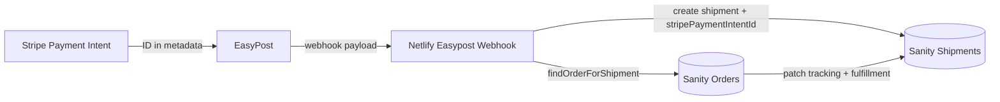

# EASYPOST WEBHOOK FIX

## Stop Referencing Stripe Payment Intent IDs as Sanity Documents

## Critical Error

## ClientError: Mutation failed: Document "2HiJPd1Jr2ND3BhnmhlP7T" references non-existent document "pi_3SZYTuP1CiCjkLwl0akOd4no"

**What's happening:**
Your EasyPost webhook tried to store a Sanity reference to a **Stripe Payment Intent ID** (`pi_3SZYTuP1CiCjkLwl0akOd4no`) as if it were a Sanity document ID.

**Why it fails:**
Stripe payment intent IDs exist only inside Stripe. Sanity references must point to real documents in your dataset (e.g. `2HiJPd1Jr2ND3BhnmhlP7T`).

## Root Cause

### Current Broken Code
```ts
// ❌ WRONG - Using Stripe ID as Sanity reference
const paymentIntentId = webhookPayload.metadata?.payment_intent_id

await sanity.create({
  _type: 'shipment',
  _id: easypostShipmentId,
  trackingCode: webhookPayload.tracking_code,
  order: {
    _type: 'reference',
    _ref: paymentIntentId, // ❌ This is "pi_3SZY..." - NOT a Sanity document!
  },
})
```

**Problem:** `pi_3SZYTuP1CiCjkLwl0akOd4no` is a Stripe identifier. Sanity gladly stores the reference, but the dataset cannot resolve it.

## Solution: Look Up the Sanity Order First

### Fixed Webhook Code
**File:** `netlify/functions/easypostWebhook.ts`

```ts
const orderLookup = await findOrderForShipment(shipmentData)
await upsertShipmentDocument(shipmentData, rawPayload, orderLookup)

if (!orderLookup.order?._id) {
  console.warn('easypostWebhook unable to locate order for shipment', {
    shipmentId,
    orderIdCandidate: orderLookup.orderIdCandidate,
    paymentIntentId: orderLookup.paymentIntentId,
    orderNumberCandidate: orderLookup.orderNumberCandidate,
    trackingNumber,
  })
  return
}

const order = orderLookup.order
await sanity
  .patch(order._id)
  .set({...})
  .commit()
```

The helper inspects EasyPost metadata, references, tracking codes, and Stripe payment intent IDs. It tries multiple strategies until it finds a valid Sanity order ID and only then creates the reference.

### ✅ Key Changes

1. **Payment intent safe-guard** – `normalizeOrderId` now rejects values that resemble Stripe IDs, so we never treat `pi_*` strings as document IDs.
2. **Order lookup helper** – `findOrderForShipment` queries Sanity by `_id`, EasyPost shipment IDs, tracking numbers, Stripe payment intent IDs, order numbers, and finally customer email + recent timestamp.
3. **Upsert with context** – `upsertShipmentDocument` receives the lookup result, stores `stripePaymentIntentId`, and only sets the `order` reference when the document exists.
4. **Detailed logging** – missing order logs now include shipment ID, payment intent metadata, and order numbers so you can trace failures quickly.

### ✅ Error Handling

```ts
if (!orderLookup.order?._id) {
  console.warn('easypostWebhook unable to locate order for shipment', {
    shipmentId,
    paymentIntentId: orderLookup.paymentIntentId,
    orderNumberCandidate: orderLookup.orderNumberCandidate,
  })
  return
}
```

EasyPost will retry and the shipment document is still written with raw webhook data plus the `stripePaymentIntentId` field so you can link it later.

### ✅ Fallback Lookup Strategies

```ts
const orderById = await sanity.fetch(`*[_type == "order" && _id == $orderId][0]${ORDER_PROJECTION}`)
const orderByShipment = await sanity.fetch(`*[_type == "order" && (easyPostShipmentId == $shipmentId || easyPostTrackerId == $trackerId || trackingNumber == $trackingNumber)][0]${ORDER_PROJECTION}`)
const orderByPi = await sanity.fetch(`*[_type == "order" && stripeSummary.paymentIntentId == $piId][0]${ORDER_PROJECTION}`)
const orderByNumber = await sanity.fetch(`*[_type == "order" && orderNumber == $orderNumber][0]${ORDER_PROJECTION}`)
const orderByEmail = await sanity.fetch(`*[_type == "order" && customerEmail == $email && _createdAt > $since] | order(_createdAt desc)[0]${ORDER_PROJECTION}`)
```

### Alternative: Store as String Field

`packages/sanity-config/src/schemaTypes/documents/shipment.ts`

```ts
defineField({
  name: 'stripePaymentIntentId',
  title: 'Stripe Payment Intent ID',
  type: 'string',
  description: 'External Stripe payment intent identifier used to charge this shipment',
})
```

This field keeps Stripe metadata without pretending it is a Sanity reference. The `order` field now clearly describes that it must contain a Sanity order document.

### Webhook Code

```ts
const stripePaymentIntentId = orderLookup?.paymentIntentId ?? extractPaymentIntentIdFromShipment(shipment)

const doc = cleanUndefined({
  ...,
  stripePaymentIntentId,
  order: orderLookup.order?._id
    ? {_type: 'reference', _ref: orderLookup.order._id}
    : undefined,
})
```

### Fix Existing Broken Shipments

`scripts/fixBrokenShipmentReferences.ts`

```ts
const shipments = await sanity.fetch(`*[_type == "shipment" && defined(order) && !defined(order->_id)]{_id, "brokenRef": order._ref}`)

if (looksLikeStripePaymentIntentId(shipment.brokenRef)) {
  const order = await findOrderByPaymentIntent(paymentIntentId)
  // ✅ Re-link or store string fallback
}
```

Run with `pnpm tsx scripts/fixBrokenShipmentReferences.ts` to convert `order._ref = pi_*` into either a valid order reference or a `stripePaymentIntentId` string.

### Prevention: Add Metadata to EasyPost Shipments

```ts
const shipment = await easypost.Shipment.create({
  ...,
  metadata: {
    sanity_order_id: order._id,
    order_number: order.orderNumber,
    payment_intent_id: paymentIntentId,
  },
})
```

When the EasyPost webhook receives the payload it can immediately grab `sanity_order_id` and avoid any lookup.

### Testing

```ts
const testPaymentIntentId = 'pi_3SZYTuP1CiCjkLwl0akOd4no'
const order = await sanity.fetch(`*[_type == "order" && stripeSummary.paymentIntentId == $piId][0]{_id, orderNumber}`, {piId: testPaymentIntentId})
```

```ts
const shipment = await sanity.fetch(`*[_type == "shipment" && _id == $id][0]{_id, trackingCode, order->{_id, orderNumber}}`, {id: easypostShipmentId})
```

### Complete Fixed Webhook

`netlify/functions/easypostWebhook.ts` now:

- Verifies webhook signatures.
- Normalizes shipment metadata.
- Resolves Sanity order references through `findOrderForShipment`.
- Stores Stripe payment intent IDs as strings.
- Updates the originating order with label, carrier, tracker, and status information.

### Debugging Queries

```groq
*[_type == "order" && stripeSummary.paymentIntentId == "pi_3SZYTuP1CiCjkLwl0akOd4no"][0]{_id, orderNumber}
```

```groq
*[_type == "shipment" && defined(order) && !defined(order->_id)]{_id, trackingCode, "brokenRef": order._ref}
```

```groq
*[_type == "shipment" && !defined(order)]{_id, trackingCode, reference, stripePaymentIntentId}
```

### Success Criteria

- ✅ No more “references non-existent document” errors from Sanity mutations.
- ✅ Shipments link back to valid Sanity orders.
- ✅ Stripe payment intent IDs are preserved for debugging without polluting references.
- ✅ New helper resolves orders via metadata, payment intent, order number, or customer email.
- ✅ Cleanup script repairs historical shipments.

### Monitoring

```ts
console.log('EasyPost webhook:', {
  event: payload.description,
  shipmentId: easypostShipmentId,
  trackingCode,
  paymentIntentId,
  foundOrder: order ? order._id : 'NOT_FOUND',
  orderNumber: order?.orderNumber,
})
```

### Integration Diagram


